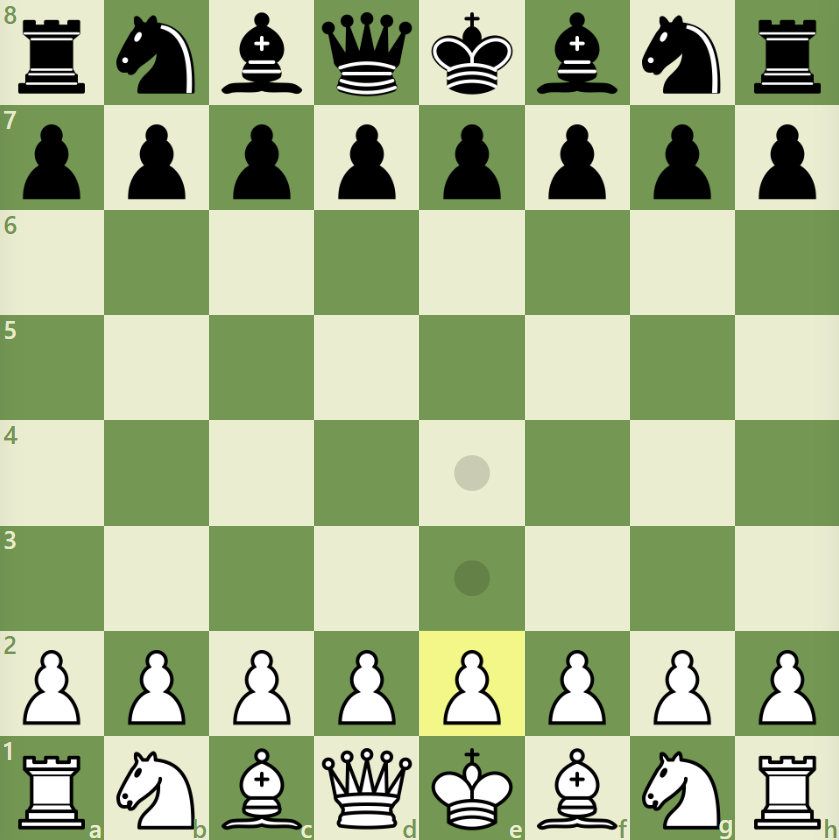
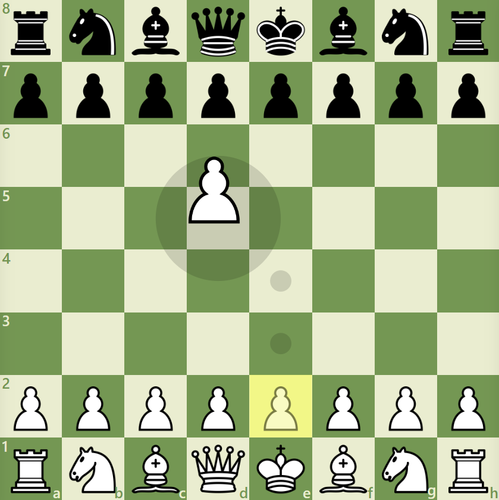
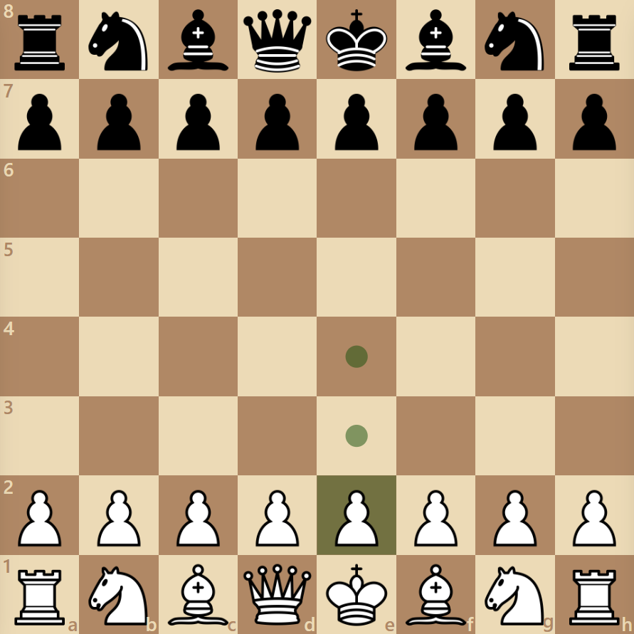
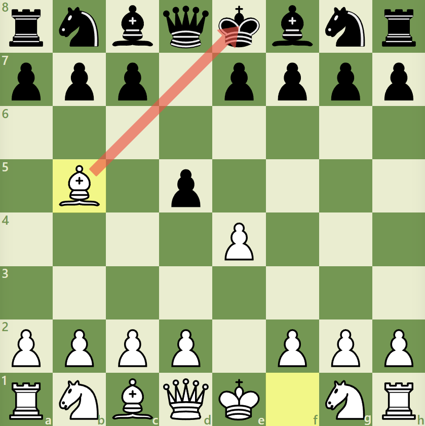

# docs/guide.md

# SimpleChessBoard — Full Guide

## Table of Contents

- [1. How to create a board](#1-how-to-create-a-board)
  - [All the parameters](#all-the-parameters)
- [2. How to listen to an event](#2-how-to-listen-to-an-event)
  - [Very common use case](#very-common-use-case)
- [3. How to remove an event](#3-how-to-remove-an-event)
- [4. How to create new events inside the board](#4-how-to-create-new-events-inside-the-board)
- [5. Interactivity configuration](#5-interactivity-configuration)
- [6. Style configuration](#6-style-configuration)
- [7. How to create marks with code](#7-how-to-create-marks-with-code)
- [8. How to remove marks with code](#8-how-to-remove-marks-with-code)
- [9. API Reference](#9-api-reference)
- [10. Chess helpers (optional utilities)](#10-chess-helpers-optional-utilities)
- [Practical Examples](#practical-examples)
- [Feedback & Contributions](#feedback--contributions)

---

## 1. How to create a board

With this setup, the board will work using the default configuration values.

```js
import { SimpleChessBoard } from '0dexz0/simple-chess-board'

const board = new SimpleChessBoard({
    container: document.getElementById('board'),
})
```



### All the parameters

There are **8 parameters**, all except the container are optional.

```js
const board = new SimpleChessBoard({
    container: document.getElementById('board'),
    position: "rnbqkbnr/pppppppp/8/8/8/8/PPPPPPPP/RNBQKBNR w KQkq",
    playerColor: 'w',
    orientation: 'w',
    piecesPath: "../assets/pieces/Default-SVG/default.svg",
    interactivity: {
        ...
    },
    style: {
        ...
    },
    $listeners: {}
})
```

## 2. How to listen to an event

```js
import { SimpleChessBoard } from '0dexz0/simple-chess-board'

const board = new SimpleChessBoard({
    container: document.getElementById('board'),

    $listeners: {
        'selection:change': (data) => {},
        // data: { pieceElement: SVGUseElement, square: string }

        'selection:clear': () => {},
        // data: void

        'drag:start': (data) => {},
        // data: { originalPiece: SVGUseElement, clonePiece: SVGUseElement }

        'drag:end': (data) => {},
        // data: { pieceElement: SVGUseElement, from: string, to: string }

        'drag:cancel': (data) => {},
        // data: { pieceElement: SVGUseElement, from: string, to: string }

        'illegal-drop': (data) => {},
        // data: { pieceElement: SVGUseElement, from: string, to: string }

        'move:end': (data) => {},
        // data: { pieceElement: SVGUseElement, move: ChessMove, animated: boolean }

        'manual-promote:end': (data) => {},
        // data: { from: Pos, to: Pos, animated: boolean, promotion: string }

        'flip-board:end': (data) => {},
        // data: { force?: "w" | "b", newOrientation: "w" | "b" }

        'undo:end': (data) => {},
        // data: { move: ChessMove }

        'redo:end': (data) => {},
        // data: { move: ChessMove }

        'reset-position:before': (data) => {},
        // data: { cancel: () => boolean }

        'reset-position:end': () => {},
        // data: void

        'undo-all:end': () => {},
        // data: void

        'redo-all:end': () => {},
        // data: void
    }
})
```

#### Or you can just:

```js
const board = new SimpleChessBoard({...})

board.on('move:end', (data) => {
    ...
})
```

### Very common use case

As you know, we can only move pieces **whose color matches our playerColor**.

Sometimes the user might want to **play alone**. We can use event listeners to achieve that.

```js
board.on('move:end', () => {
    board.playerColor = board.playerColor === 'w' ? 'b' : 'w'
})
```

But what happens if we have navigation enabled and **undo one move** by pressing the **left arrow key on the keyboard**?

Easy, we simply listen for the **'undo:end' event**, and switch sides.

```js
board.on('undo:end', () => {
    board.playerColor = board.playerColor === 'w' ? 'b' : 'w'
})
```

*With this simple setup, you can play alone.*

## 3. How to remove an event

Just as we can add events with **'board.on(...)'**, we can also remove them with **'board.off(...)'**

### Remove all listeners that use a specific function from a specific event

```js
function doSomething() {
    // hell nah
}

board.on('move:end', doSomething)

// This will remove all listeners that use that function within that event
board.off('move:end', doSomething)
```

### Remove all listeners from a specific event

```js
board.on('move:end', doSomething)
board.on('move:end', doNothing)
board.on('move:end', justExist)

board.off('move:end')
```

### Remove all listeners from all events

```js
board.on('move:end', whenMoveEnd)
board.on('undo:end', whenUndoEnd)
board.on('reset-position:end', whenResetPositionEnd)

board.off()
```

## 4. How to create new events inside the board

You can achieve many things with current events. But there are cases where current events won't work for a specific situation.

In those cases, you will need to go into the file `.../core/SimpleChessBoard.js` and add new events.

The code is separated into #regions, so I recommend using the Region Viewer extension to quickly find the location where you want to "emit" the event.

### Example

```js
undoMove() {
    ...
    const lastMove = moves[this.#historyState.currentIndex--]
    ...
    // `this.#emit` takes two parameters: the event name and the data it returns.
    this.#emit('undo:end', { move: lastMove })
}
```

### A more advanced example

```js
resetPosition() {
    let canceled = false

    this.#emit('reset-position:before', { cancel: () => canceled = true })

    if (canceled) return

    this.setPosition(this.#position)
    this.#emit('reset-position:end')
}

board.on('reset-position:before', ({ cancel }) => {
    if (condition) {
        cancel()
    }
})
```

### Clarification

Both the event names and the data they return are typed with JSDoc, so there's no need to memorize them.

If you think it might be useful to add a specific event or modify the data of an existing one, make a pull request or open an issue.

The naming convention for events is **`category:phase`**.

**`category`** indicates the group or type of event, such as `move`, `undo`, `reset-position`, `manual-promote`.

**`phase`** indicates the time or state of the event, such as `before`, `end`.

## 5. Interactivity Configuration

When we created a new board, there was a property called `interactivity`.

```js
const board = new SimpleChessBoard({
    ...
    interactivity: {
        ...
    }
    ...
})
```

The interactivity object defines the interactivity rules of a chess board.

### Master switch for interactivity

```js
interactivity: {
    enabled: true // If this is disabled, all interactivity is disabled
    ...
}
```

### Drag

```js
interactivity: {
    ...
    drag: {
        enabled: true, // enables the ability to drag
        trail: {
            enabled: true, // enables trail functionality
            circle: true // enables the circle-specific trail (useful for mobile devices)
        }
    }
    ...
}
```

### Selection

```js
interactivity: {
    ...
    selection: {
        enabled: true, // enable the ability to select pieces
        ownPieces: true, // own pieces can be selected
        enemyPieces: true, // enemy pieces can be selected (doesn't mean you can move them)
    },
    ...
}
```

### Deselection

```js
interactivity: {
    ...
    deselection: {
        enabled: true, // I think you got the idea. Try to understand the following now.

        onClick: {
            enabled: true,
            empty: true,
            selectedPiece: true
        },

        onDrop: {
            enabled: false,
            illegalMove: true,
            selectedPiece: false,
        },
    },
    ...
}
```

### Marks

```js
interactivity: {
    ...
    marks: {
        enabled: true,
        squares: true,
        arrows: true
    },
    ...
}
```

### Navigation

```js
interactivity: {
    ...
    keyboard: {
        enabled: true,

        navigation: {
            enabled: true,
            undoMove: true,
            redoMove: true,
            undoAllMoves: true,
            redoAllMoves: true
        },

        shortcuts: {
            enabled: true,
            flipBoard: true, // f key
            toggleMarks: true // m key
        }
    }
}
```

### Clarification

You're probably wondering why there are so many "enabled".

Imagine you want to temporarily disable all navigation for some reason. Instead of setting each option to false, you would simply set `interactivity.keyboard.navigation.enabled = false`.

Verbally, you would be saying: **"Disable the interactivity of the keyboard navigation."**

*All values shown are the default values for interactivity*

## 6. Style Configuration

```js
const board = new SimpleChessBoard({
    ...
    style: {
        ...
    }
    ...
})
```

### Board

```js
style {
    board: {
        color1: "#739552",
        color2: "#EBECD0"
    },
    ...
}
```

### Drag Piece

```js
style {
    ...
    cursor: "grabbing",
        original: { opacity: 0.5 },
        clone: {
            opacity: 1,
            scale: 1,
            deltaPosition: {
                x: 0,
                y: 0
            }
        },
    ...
}
```

### Drag Trail

```js
style {
    ...
    dragTrail: {
        circle: { radius: 0.75, color: "black", opacity: 0.141 },
    },
    ...
}
```

### Piece

```js
style {
    ...
    piece: {
        cursor: "grab",
        animation: {
            x: { time: '0.3s', type: 'ease' },
            y: { time: '0.3s', type: 'ease' },
            opacity: { time: '0.2s', type: 'ease' }
        }
    },
    ...
}
```

### Legal Moves

```js
style {
    ...
    legalMove: {
        empty: { radius: 0.17, color: "black", opacity: 0.141 },
        capture: { radius: 0.45, color: "black", opacity: 0.141 }
    },
    ...
}
```

### Highlight Square

```js
style {
    ...
    highlightSquare: {
        selectedPiece: { color: "rgb(255, 255, 51)", opacity: 0.5 },

        lastMove: {
            from: { color: "rgb(255, 255, 51)", opacity: 0.5 },
            to: { color: "rgb(255, 255, 51)", opacity: 0.5 }
        },

        checkKing: { color: "#ff0000", opacity: 0.502 }
    },
    ...
}
```

### Marks

```js
style {
    ...
    marks: {
        squares: {
            normal: { color: 'rgb(235, 97, 80)', opacity: '0.8' },
            shift: { color: 'rgb(172, 206, 89)', opacity: '0.8' },
            ctrl: { color: 'rgb(255, 170, 0)', opacity: '0.8' },
            alt: { color: 'rgb(82, 176, 220)', opacity: '0.8' }
        },

        arrows: {
            normal: { color: 'rgba(255, 170, 0, 0.8)', opacity: '0.8' },
            shift: { color: 'rgba(159, 207, 63, 0.8)', opacity: '0.8' },
            ctrl: { color: 'rgba(248, 85, 63, 0.8)', opacity: '0.8' },
            alt: { color: 'rgba(72, 193, 249, 0.8)', opacity: '0.8' }
        }
    }
}
```

### Clarification

All the variables are reactive, meaning that if you modify a value, it will be updated immediately.

The only exception is the radius of the legal move and drag trail circle.

*All values shown are the default values for style*

## 7. How to create Marks with code

As a user, with a right click you can create squares and arrows.

There are 4 types of marks: `normal`, `shift`, `ctrl`, `alt`.

### Mark square

```js
board.renderMarkSquare('normal', 'e2')
board.renderMarkSquare('shift', {x: 2, y: 3})
board.renderMarkSquare('ctrl', pieceElement)

// You can also modify the style of a mark
board.renderMarkSquare('normal', 'e2', {
    opacity: 0.5,
    color: 'green',
    typeStyle: 'alt'
})
```

These 4 types of squares are squares that the user can normally make with the right click if the interactivity of marks is enabled.

This means that if the user performs any action that removes the markers, such as left-clicking, the markers we added will be removed, even if we added them with code.

### The Solution

There is a fifth type, the `persistent`

```js
// No matter what the user does, it will never be removed
board.renderMarkSquare('persistent', 'e2')

/*
   But unlike the other 4 types, the 'persistent' type has no styles
   So by default it will be black
*/

// So let's give it the style of one of the 4 types
board.renderMarkSquare('persistent', 'e2', {
    typeStyle: 'ctrl'
})
```

### Mark arrow

```js
// Same idea as square mark
board.renderMarkArrow('normal', 'e2', 'e4')
board.renderMarkArrow('shift', {x: 2, y: 3}, 'e4')
board.renderMarkArrow('ctrl', pieceElement, { x: 1, y:0 })

board.renderMarkArrow('normal', 'e2', 'e4', {
    opacity: 0.5,
    color: 'green',
    typeStyle: 'alt'
})

board.renderMarkArrow('persistent', 'e2', 'e4', {
    color: 'green',
    opacity: '0.5'
})
```

## 8. How to remove Marks with code

### Mark square

```js
// Remove a specific square of a specific type.
board.clearMarksSquares('normal', 'e2')
board.clearMarksSquares('shift', 'e2')
board.clearMarksSquares('ctrl', 'e2')
board.clearMarksSquares('alt', 'e2')
board.clearMarksSquares('persistent', 'e2')

// Remove a specific square from all types (persistent is not affected)
board.clearMarksSquares(null, 'e2')

// Remove all squares from a specific type
board.clearMarksSquares('normal')
board.clearMarksSquares('persistent')

// Remove all squares from all types (persistent is not affected)
board.clearMarksSquares()
```

### Mark arrow

```js
// Remove a specific arrow of a specific type
board.clearMarksArrows('normal', 'e2', 'e4')
board.clearMarksArrows('shift', 'e2', 'e4')
board.clearMarksArrows('ctrl', 'e2', 'e4')
board.clearMarksArrows('alt', 'e2', 'e4')
board.clearMarksArrows('persistent', 'e2', 'e4')

// Remove a specific arrow from all types (persistent is not affected)
board.clearMarksArrows(null, 'e2', 'e4')

// Remove all arrows from a specific type
board.clearMarksArrows('normal')
board.clearMarksArrows('persistent')

// Remove all arrows from all types (persistent is not affected)
board.clearMarksArrows()
```

### Mark square and Mark arrow

```js
// Remove all square marks and arrow marks of a specific type
board.clearMarks('normal')
board.clearMarks('shift')
board.clearMarks('ctrl')
board.clearMarks('alt')
board.clearMarks('persistent')

// Remove all square marks and arrow marks from all types (persistent is not affected)
board.clearMarks()
```

## 9. API Reference

### Reactive Properties (Getters / Setters)

| Property | Type | Description |
| :-------- | :------- | :------------------------- |
| `position` | `string` | Initial position of the board. To recover the current position and not the initial one, use `chessLogic.fen()` |
| `playerColor` | `'w' \| 'b'` | You can only move pieces that have the same color as the `playerColor`. |
| `orientation` | `'w' \| 'b'` | Visual orientation of the board (`'w'` = white at bottom, `'b'` = black at bottom). |
| `piecesPath` | `string` | Path to the SVG sprite for pieces. Changing it reloads all piece images. |

### Core Board Methods

| Method | Description |
| :-------- | :------- |
| `setPosition(fen, { throwOnError })` | Loads a FEN position. Returns true on success, false on error unless `throwOnError: true`. |
| `resetPosition()` | Resets to the initial position (emits reset-position:before and :end events). |
| `setPlayerColor(color)` | Changes the player's color to the new value. |
| `flipBoard(force?)` | Rotates the board. Pass `'w'` or `'b'` to force a side down, otherwise toggles. |
| `setPiecesPath(newPath)` | Changes the path of the SVG file containing the sprites of the pieces to a new path. |
| `toggleMarks()` | Shows/hides all user marks (squares and arrows). |

### Piece Selection & Movement

| Method | Description |
| :-------- | :------- |
| `selectPiece(pos, { clearMarks })` | Highlights a piece and shows its legal moves. Returns `true` if a piece exists at that position. |
| `executeMove(from, to, animate?, promotion?)` | Programmatically executes a move. If promotion is needed and not provided, the promotion UI will appear (unless you pass the promotion piece). |

### Getters & Converters

| Method | Description |
|--------|-------------|
| `getPieceElementFrom(pos)` | Returns the SVG element of the piece at the given position (or `null`). |
| `getLastDeadPieceElement()` | Returns the most recently captured piece element. |
| `findKingCoords(color)` | Returns `{ x, y }` coordinates of the king for the given color (`'w'` or `'b'`). |
| `normalizeToCoords(pos)` | Converts a Pos into `{ x, y }` coordinates. |
| `normalizeToSquare(pos)` | Converts a Pos into a square string (e.g., `'e2'`). |

### Validators

| Method | Description |
|--------|-------------|
| `isLegalMove(pos)` | Checks if a square is a legal move for the currently selected piece. |
| `isEmpty(pos)` | Returns `true` if there is no piece on the given square. |
| `isMyPiece(pos)` | Returns `true` if the piece on the square belongs to the current `playerColor`. |
| `isMyTurn()` | Returns `true` if `playerColor` matches the side to move in the chess logic. |
| `chessLogic` | Provides access to the internal chess.js instance for more complex or specific validations. Do not use it to modify the board state or piece positions, as it may desynchronize the visual board. |

#### Example using `chessLogic`:

```js
if (board.chessLogic.inCheck()) {
    console.log('The king is in check!')
    console.log('Current position:', board.chessLogic.fen())
}
```

### Marks

As explained in [section 7](#7-how-to-create-marks-with-code), there are 5 types of marks: `'normal'`, `'shift'`, `'ctrl'`, `'alt'`, and `'persistent'`. The first four can be removed by user interaction (e.g., clicking on the board), while `'persistent'` marks remain until manually cleared.

| Method | Description |
|--------|-------------|
| `renderMarkSquare(type, pos, options?)` | Adds a mark square of the specified type. |
| `renderMarkArrow(type, from, to, options?)` | Adds a mark arrow of the specified type. |

### History Navigation

| Method | Description |
|--------|-------------|
| `undoMove()` | Reverts the last move (emits undo:end). |
| `redoMove()` | Re-applies the next move (emits redo:end). |
| `undoAllMoves()` | Undoes every move in history (emits undo-all:end). |
| `redoAllMoves()` | Redoes all moves up to the latest (emits redo-all:end). |
| `clearHistory()` | Clears the internal move history (does not affect the board position). |

### Cleanup Methods

| Method | Description |
|--------|-------------|
| `clearAll()` | Clears selection, legal moves, all marks (excluding persistent), drag trails, last-move highlight, promotion dialog, and history. |
| `clearSelection()` | Deselects the currently selected piece, clears legal moves, and removes drag trails. |
| `clearMarks(type?)` | Removes all marks (squares and arrows). Optionally only one type (e.g., `'normal'`). Does not affect `'persistent'` unless explicitly passed. |
| `clearMarksSquares(type?, pos?)` | Removes square marks. If `type` is provided, only removes squares of that type. If `pos` is provided, only removes the specific square. |
| `clearMarksArrows(type?, from?, to?)` | Removes arrow marks. If `type` is provided, only removes arrows of that type. If `from` and `to` are provided, only removes the specific arrow. |
| `clearDragTrails()` | Removes the drag trail circle. |
| `clearHsLastMove()` | Removes the highlight of the last move (green squares). |
| `clearHistory()` | Clears the internal move history (does not affect the board position). |
| `cancelPromotion()` | Dismisses the promotion dialog if it is currently open, and clears the pending promotion request. |

### Events

| Method | Description |
|--------|-------------|
| `on(eventName, callback)` | Registers a listener for the specified event. [See details →](#2-how-to-listen-to-an-event) |
| `off(eventName?, callback?)` | Removes listeners from events. [See details →](#3-how-to-remove-an-event) |
| `#emit(eventName, data)` | Create new events. [See details →](#4-how-to-create-new-events-inside-the-board) |

**Available events and their returned data:**

| Event | Returned Data |
|-------|---------------|
| `selection:change` | `{ pieceElement: SVGUseElement, square: string }` |
| `selection:clear` | `void` |
| `drag:start` | `{ originalPiece: SVGUseElement, clonePiece: SVGUseElement }` |
| `drag:end` | `{ pieceElement: SVGUseElement, from: string, to: string }` |
| `drag:cancel` | `{ pieceElement: SVGUseElement, from: string, to: string }` |
| `illegal-drop` | `{ pieceElement: SVGUseElement, from: string, to: string }` |
| `move:end` | `{ pieceElement: SVGUseElement, move: ChessMove, animated: boolean }` |
| `manual-promote:end` | `{ from: Pos, to: Pos, animated: boolean, promotion: string }` |
| `flip-board:end` | `{ force?: "w" \| "b", newOrientation: "w" \| "b" }` |
| `undo:end` | `{ move: ChessMove }` |
| `redo:end` | `{ move: ChessMove }` |
| `reset-position:before` | `{ cancel: () => boolean }` |
| `reset-position:end` | `void` |
| `undo-all:end` | `void` |
| `redo-all:end` | `void` |

### Type Pos

Can be any of the following formats:

| Format | Example |
|--------|---------|
| Square string | `'e2'` |
| Coordinates object | `{ x: 4, y: 5 }` |
| Piece element (SVGUseElement) | `pieceElement` (uses its `data-square` attribute) |

All methods that accept a Pos (`selectPiece`, `executeMove`, `isEmpty`, `isMyPiece`, `isLegalMove`, `getPieceElementFrom`, `renderMarkSquare`, `renderMarkArrow`, etc.) support any of these three formats.

## 10. Chess Helpers (Optional Utilities)

The library includes a set of optional helper functions designed to be imported only when needed. Since they are not part of the core board logic, any helper you do not import will be excluded from your final bundle (tree-shaking friendly). This allows both you and us to add as many utilities as you want without worrying about bloat.

The helpers are currently located in `simple-chess-board/helpers` and demonstrate how you can extend the board’s behaviour with just a few lines of code.

### Available Helpers

```js
export function makeRandomMove(board) {
    const moves = board.chessLogic.moves({ verbose: true })
    const move = moves[Math.floor(Math.random() * moves.length)]

    if (move) {
        board.executeMove(move.from, move.to, true, move.promotion)
        return true
    } else {
        return false
    }
}

export function switchPlayerColor(board) {
    board.playerColor = board.playerColor === 'b' ? 'w' : 'b'
}

export function enhanceKnightLMove(board, extraTimeX = 0, extraTimeY = -0.1) {
    const knightMoveHandler = ({ pieceElement, move, animated }) => {
        if (move.piece === 'n' && animated) {

            const transitionValue = `
                x calc(var(--piece-animation-x-time) + ${extraTimeX}s) var(--piece-animation-x-type),
                y calc(var(--piece-animation-y-time) + ${extraTimeY}s) var(--piece-animation-y-type),
                opacity var(--piece-animation-opacity-time) var(--piece-animation-opacity-type)
            `;

            pieceElement.style.transition = transitionValue;

            pieceElement.addEventListener('transitionend', () => { pieceElement.style.transition = '' }, { once: true });
        }
    };

    board.on('move:end', knightMoveHandler);
    return () => board.off('move:end', knightMoveHandler);
}
```

### Usage Example

[As you can see here.](#very-common-use-case)

```js
board.on('move:end', () => {
    board.playerColor = board.playerColor === 'w' ? 'b' : 'w'
})
```

#### You can do the same using a Helper

```js
board.on('move:end', () => {
    switchPlayerColor(board)
})
```

#### To execute a random move, instead of writing the code, you can use the helper

```js
setInterval(() => {
    makeRandomMove(board)
}, 1000)
```

#### You can also use a helper to make the knight perform a different movement effect.

```js
// Each time a knight moves, it will move as defined by the enhanceKnightLMove function.
const removeEnhancedKnightMove = enhanceKnightLMove(board)

// This is how we remove the enhanced movement
removeEnhancedKnightMove()
```

#### Comment

If you have any ideas for a helper or improvements to the current ones, feel free to submit a PR or open an issue.

## Practical Examples

Below are short examples showing how to integrate `SimpleChessBoard` into some common chess scenarios.

### Example 1: Local Two-Player (Human vs Human)

```js
import { SimpleChessBoard } from '0dexz0/simple-chess-board'
import { switchPlayerColor } from '0dexz0/simple-chess-board/helpers'

const board = new SimpleChessBoard({
    container: document.getElementById('board'),
})

// After moving a piece, we change players
board.on('move:end', () => switchPlayerColor(board))

// After undo a move, we change players
board.on('undo:end', () => switchPlayerColor(board))
```

#### Or you can define the listeners in the constructor

```js
import { SimpleChessBoard } from '@0dexz0/simple-chess-board'
import { switchPlayerColor } from '@0dexz0/simple-chess-board/helpers'

const board = new SimpleChessBoard({
    container: document.getElementById('board'),

    $listeners: {
        'move:end': () => switchPlayerColor(board),
        'undo:end': () => switchPlayerColor(board)
    }
})
```

### Example 2: Human vs Random Engine

```js
import { SimpleChessBoard } from '@0dexz0/simple-chess-board'

const board = new SimpleChessBoard({
    container: document.getElementById('board'),
})

function engineThinkNextMove() {
    /*
    A real engine should use this to move the piece:
    board.executeMove(from, to, animate, promotion)

    For Example with stockfish UCI result (e.g., 'e2e4'):

    const [from, to, promotion] = [uci.slice(0,2), uci.slice(2,4), uci[4]]
    board.executeMove(from, to, true, promotion)

    // The 'true' option makes it move with animation.
    */
}

board.on('move:end', () => {
    if (board.isMyTurn() === false) {
        engineThinkNextMove()
    }
})
```

#### Or defining inside the constructor

```js
import { SimpleChessBoard } from '@0dexz0/simple-chess-board'
import { makeRandomMove } from '@0dexz0/simple-chess-board/helpers'

const board = new SimpleChessBoard({
    container: document.getElementById('board'),

    $listeners: {
        'move:end': () => {
            if (board.isMyTurn() === false) {
                engineThinkNextMove()
            }
        }
    }
})

function engineThinkNextMove() {...}
```

In short, when it's not your turn, tell the Engine to think about its move. When it tells you what move it's going to make, simply execute `executeMove(...)` with the move it told you. It's that simple.

### Example 3: Drag Piece for Mobile

```js
// Inside the constructor
const board = new SimpleChessBoard({
    container: document.getElementById('board'),

    interactivity: {
        drag: {
            trail: {
                enabled: true
            }
        }
    },

    style: {
        dragPiece: {
            clone: {
                scale: 1.5,
                deltaPosition: {
                    y: -0.5
                }
            }
        }
    }
})

// Or outside the constructor
board.interactivity.drag.trail.enabled = true

const dragClone = board.style.dragPiece.clone
dragClone.scale = 1.5
dragClone.deltaPosition.y = -0.5
```



### Example 4: Custom Theme

```js
const board = new SimpleChessBoard({
    container: document.getElementById('board'),
    style: {
        board: {
            color1: '#f0d9b5',
            color2: '#b58863'
        },
        piece: {
            animation: {
                x: { time: '0.15s', type: 'ease-out' },
                y: { time: '0.15s', type: 'ease-out' },
                opacity: { time: '0.3s', type: 'ease'}
            }
        },
        dragTrail: {
            circle: { radius: 0.6, color: '#d3ba2f', opacity: 0.3 }
        },
        ...
    }
})

// Or you can just import a theme:
import { LICHES_STYLE } from '@0dexz0/simple-chess-board/themes'

const board = new SimpleChessBoard({
    container: document.getElementById('board'),
    style: LICHES_STYLE
})
```



### Example 5: Arrow to the king in check

```js
// Inside the constructor
const board = new SimpleChessBoard({
    container: document.getElementById('board'),

    $listeners: {
        'move:end': ({ move }) => {
            if (board.chessLogic.isCheck()) {
                const from = move.to
                const to = board.findKingCoords(board.playerColor)
                board.renderMarkArrow('ctrl', from, to)
            }
        }
    }
})

// Or outside the constructor
const board = new SimpleChessBoard({
    container: document.getElementById('board'),
})

board.on('move:end', ({ move }) => {
    if (board.chessLogic.isCheck()) {
        const from = move.to
        const to = board.findKingCoords(board.playerColor)
        board.renderMarkArrow('ctrl', from, to)
    }
})
```



## Feedback & Contributions

- Found a bug?
- Have an idea or suggestion?

Feel free to open an [issue](https://github.com/0dexz0/simple-chess-board/issues) or submit a pull request.

**All contributions are welcome!**