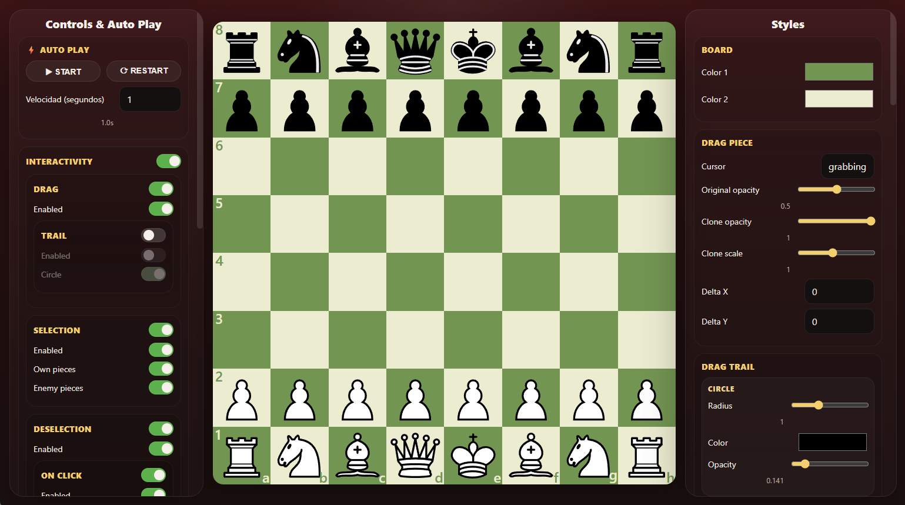

# **SimpleChessBoard**
[](https://www.npmjs.com/package/@0dexz0/simple-chess-board)
[](https://opensource.org/licenses/MPL-2.0)

An open-source chessboard library focused on simplicity, with real-time style customization and flexible interactivity.

## Installation

```bash
npm install @0dexz0/simple-chess-board
```

## Live Demo / Screenshot

Try the live demo: [SimpleChessBoard Demo](https://0dexz0.github.io/simple-chess-board/)



## Features

- Rendered with SVG
- Simple to use: create a board with one line of code
- Reactive style: change colors, animations, opacity at runtime
- Flexible interactivity
- Event system for moves, undo/redo, reset, and custom events
- Mobile support
- Chess logic powered by [chess.js](https://github.com/jhlywa/chess.js)

## Quick Start

```js
import { SimpleChessBoard } from '@0dexz0/simple-chess-board'

const board = new SimpleChessBoard({
    container: document.getElementById('board'),
})
```

## Documentation

See the full guide in [GUIDE.md](GUIDE.md).

## Feedback & Contributions

- Found a bug?
- Have an idea or suggestion?

Feel free to open an [issue](https://github.com/0dexz0/simple-chess-board/issues) or submit a pull request.

All contributions are welcome.